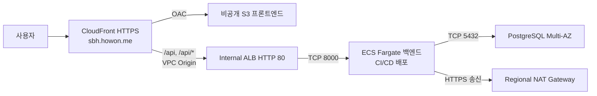

# platform-terraform

Team Freesia의 SoftBank Hackathon 서비스에 필요한 AWS 플랫폼 인프라를 관리하는 Terraform 저장소입니다.

환경별 네트워크, 프론트엔드 제공 경로, 백엔드 실행 기반, 데이터베이스와 접근 권한을 구성합니다. `env/<환경>`에서 실제 인프라를 정의하고, `modules/`의 공통 구성 요소를 조합합니다.

## dev 인프라 구성

현재 구현된 환경은 `dev`입니다. 주요 리소스는 서울 리전(`ap-northeast-2`)에, CloudFront용 ACM 인증서는 미국 동부 리전(`us-east-1`)에 구성합니다.



| 구성 | 내용 |
|---|---|
| 네트워크 | VPC `10.20.0.0/16`, 두 AZ(`ap-northeast-2a`, `ap-northeast-2c`), App/DB Private Subnet 각 2개 |
| 인터넷 송신 | App Subnet은 Regional NAT 1개를 사용하고, DB Subnet에는 인터넷 기본 경로 없음 |
| 프론트엔드 | 비공개 S3, CloudFront OAC, SPA 경로 처리, 사용자 도메인 `sbh.howon.me` |
| API 진입점 | CloudFront VPC Origin, Internal ALB HTTP 80, Target Group 기본 포트 8000, 상태 확인 `/api/health` |
| 백엔드 실행 기반 | ECS Cluster, ECR, 실행 역할과 Task Role, CloudWatch 로그 그룹 |
| 데이터베이스 | PostgreSQL 17.11, `db.t4g.small`, Multi-AZ, 초기 DB 이름 `freesia`, 암호화, 백업 7일, 삭제 보호 |

Public Subnet은 만들지 않습니다. Internet Gateway는 Regional NAT와 CloudFront VPC Origin을 위해 VPC에 연결하며, App과 DB Subnet에는 Internet Gateway 기본 경로를 만들지 않습니다.

## Terraform과 애플리케이션 배포

| 담당 | 관리 범위 |
|---|---|
| Terraform | VPC와 라우팅, 보안 그룹, S3와 CloudFront, ACM, ALB와 Target Group, ECR, ECS Cluster와 로그 그룹, IAM, RDS, 초기값으로 생성하는 SSM Parameter |
| 애플리케이션 CI/CD | 이미지 빌드와 ECR 업로드, Task Definition 등록, 마이그레이션 Task 실행, ECS Service 생성과 갱신, 프론트 빌드 업로드 |
| 운영자 | 앱 전용 DB 사용자와 권한, `DATABASE_URL` SecureString 값, Cloudflare DNS 레코드 준비 |

CI/CD는 Terraform의 `network`, `frontend`, `backend`, `database` 출력을 배포 입력으로 사용합니다. ECS 컨테이너 이름은 `app`, 기본 포트는 `8000`이며, Task Definition과 Service는 CI/CD가 관리합니다. 배포 주체와 워크플로 구현은 별도 작업입니다.

DB 접속 정보는 `/sbh/platform/demo/backend/DATABASE_URL`의 SSM SecureString으로 준비하고 Task Definition의 Secret 참조로 주입합니다. Terraform은 초기값 `NOT_CONFIGURED`로 Parameter 리소스를 생성하고 ARN과 읽기 권한을 제공합니다. 운영자는 배포 전에 실제 접속값으로 갱신합니다. Terraform은 생성 이후 값과 관련 메타데이터 변경을 무시하고 태그만 관리하며, `value_wo`를 사용해 실제 값을 Plan과 State에 저장하지 않습니다. 현재 AWS Provider는 refresh 시 값을 복호화해 읽으므로 Terraform이 값을 전혀 조회하지 않는 구조는 아닙니다.

dev RDS 관리자 암호는 `module_managed_secret` 모드로 구성합니다. Terraform이 별도 관리자 Secret과 초기 암호를 생성하고 DB에 같은 암호를 설정하며 RDS 관리형 자동 회전은 사용하지 않습니다. 콘솔 수동 변경 시 RDS 비밀번호와 Secret 값을 함께 갱신해야 합니다. 관리자 Secret은 앱 `DATABASE_URL`과 별개입니다. 실제 적용 상태는 [Unit 12 기록](docs/ai-dlc/dev-rds-password-management.md), 변경 절차는 [Runbook](docs/runbooks/ecs-postgresql-platform.md#rds-관리자-비밀번호)을 참고합니다.

배포 입력과 순서는 [dev README](env/dev/README.md)와 [운영 Runbook](docs/runbooks/ecs-postgresql-platform.md)에서 확인합니다.

## 환경과 적용 기록

| 환경 | 구성 상태 |
|---|---|
| `dev` | ECS와 PostgreSQL 기반 인프라, CloudFront 사용자 도메인 구성 구현 |
| `stg` | 디렉터리만 준비, 환경 구성 미구현 |
| `prd` | 디렉터리만 준비, 환경 구성 미구현 |

2026-10-01 작업 기록에서는 dev 인프라의 S3 State를 확인했고, 기존 CloudFront에 사용자 도메인과 인증서를 적용한 뒤 ACM `ISSUED`, CloudFront `Deployed`를 확인했습니다. 사용자는 외부 접속이 정상이라고 보고했습니다. 애플리케이션 배포와 API/DB 연결은 별도로 검증해야 합니다.

2026-10-01 Unit 11에서 `DATABASE_URL` Parameter 하나를 초기값으로 생성했습니다. 적용 후 State는 serial 10, 관리 리소스 인스턴스 49개이며 Parameter 값 비저장과 실제 ARN 및 IAM 계약을 확인했습니다. 전체 Plan에는 기존 CloudFront Origin 표현 차이 변경 1건만 남고 이 변경은 적용하지 않았습니다. [Parameter 생성 기록](docs/ai-dlc/ecs-postgresql-platform.md#후속-변경-dev-database_url-parameter-리소스-생성), [사용자 도메인 작업 기록](docs/ai-dlc/dev-cloudfront-custom-domain.md), [프로젝트 문서](docs/README.md)에 검증 결과와 다음 작업을 정리합니다.

## 저장소 구조

```text
.
├── tf                       환경을 선택해 Terraform 명령을 실행하는 스크립트
├── env/
│   ├── dev/                 현재 dev 인프라 구성과 입력, 출력
│   ├── stg/                 stg 환경 구성 위치
│   └── prd/                 prd 환경 구성 위치
├── modules/                 환경 구성에서 사용하는 공통 AWS 구성 요소
├── scripts/                 dev mock Plan 검증 스크립트
├── tests/                   모듈 간 결합 테스트
└── docs/
    ├── README.md            진행 상태와 다음 작업
    ├── ai-dlc/              작업별 요구사항, 결정과 검증 기록
    └── runbooks/            배포, 모니터링과 복구 절차
```

## dev 실행 방법

Terraform 1.11 이상, AWS CLI와 `sbh-platform` SSO 프로필이 필요합니다. Provider와 S3 Backend는 이 프로필을 사용합니다. 상태 저장용 S3 버킷은 미리 준비하고 프론트엔드 버킷과 분리합니다.

저장소 루트에서 인증을 확인합니다.

```sh
aws sso login --profile sbh-platform
aws --profile sbh-platform sts get-caller-identity
```

처음 설정할 때 Backend 예제를 복사하고 `bucket`과 `key`를 실제 사용할 값으로 수정합니다. 이미 `backend.local.hcl`이 있으면 기존 설정을 확인합니다.

```sh
cp env/dev/backend.hcl.example env/dev/backend.local.hcl
```

초기화한 뒤 포맷, 구성과 변경 계획을 확인합니다.

```sh
./tf dev init -backend-config=backend.local.hcl -input=false
./tf dev format -check
./tf dev validate
./tf dev plan -input=false
```

`tf`는 `env/<환경>`에서 명령을 실행하고 `format`을 `terraform fmt`로 변환합니다. Plan의 생성, 변경과 삭제를 검토하고 적용 승인을 받은 뒤 실행합니다.

```sh
./tf dev apply
./tf dev output -json
```

State, Plan, `*.tfvars`, `*.local.hcl`은 Git에서 제외합니다. 비밀번호와 `DATABASE_URL` 값은 Terraform 입력, 출력이나 로그에 넣지 않습니다. mock 및 SPA 테스트 실행 방법은 [dev 로컬 검증](env/dev/README.md#로컬-검증)을 참고합니다.

## 문서와 변경 절차

- [프로젝트 진행 상태](docs/README.md): 구현, 검증, 적용 기록과 다음 작업
- [dev 구성 상세](env/dev/README.md): 네트워크, 입력과 출력, 네이밍과 태깅, Backend와 테스트
- [운영 Runbook](docs/runbooks/ecs-postgresql-platform.md): CI/CD 인수인계, 배포, 모니터링과 복구
- [AI-DLC 기록](docs/ai-dlc/): 작업별 승인 범위와 검증 근거
- [개발 규칙](AGENTS.md): Ideation → Inception → Construction → Operation 절차와 문서 유지 규칙

변경할 때는 관련 문서를 먼저 읽고, 계획, 구현, 테스트, Terraform Plan, Apply, 애플리케이션 배포, 커밋과 푸시 상태를 구분해 기록합니다.
