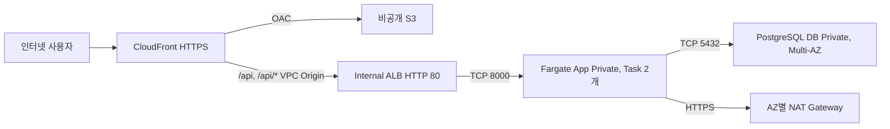

# dev ECS and PostgreSQL platform

서울 리전의 두 AZ에 CloudFront + S3, Internal ALB + Fargate, PostgreSQL Multi-AZ 인프라를 구성해요. AWS Provider와 Backend는 `sbh-platform` 프로필을 사용해요.

기본 구성은 인프라 준비 단계예요. `backend_image_digest = null`이면 ECS Cluster와 30일 로그 그룹만 만들고 Task Definition과 Service는 생성하지 않아요. 앱 이미지와 DB 계정/Secret이 준비된 후 Digest를 지정하면 Task 2개를 활성화할 수 있어요.

## 구조



| 계층 | ap-northeast-2a | ap-northeast-2c | 인터넷 경로 |
|---|---|---|---|
| Public | `10.20.0.0/24` | `10.20.1.0/24` | IGW, AZ별 NAT |
| App Private | `10.20.10.0/24` | `10.20.11.0/24` | 같은 AZ의 NAT |
| DB Private | `10.20.20.0/24` | `10.20.21.0/24` | 기본 경로 없음 |

DB는 PostgreSQL 17.11, db.t4g.small, gp3 20 GiB예요. 자동 장애 전환용 Primary와 Standby를 구성하고 읽기 복제본은 만들지 않아요. 암호화, 7일 백업, 삭제 보호와 최종 스냅샷을 사용해요.

## 입력 속성

| 속성 | 타입 | 기본값 | 역할 |
|---|---|---|---|
| `vpc_cidr` | `string` | `"10.20.0.0/16"` | 네트워크 주소로 정렬된 IPv4 /16 CIDR이에요. |
| `container_port` | `number` | `8000` | ECS, ALB Target Group과 Security Group의 앱 포트예요. |
| `health_check_path` | `string` | `"/api/health"` | ALB가 HTTP 200을 확인할 경로예요. |
| `backend_image_digest` | `string` | `null` | 동일 ECR 저장소의 `sha256:...` 이미지 Digest예요. 지정하면 서비스를 활성화해요. |
| `postgres_engine_version` | `string` | `"17.11"` | PostgreSQL 버전이에요. 변경 시 리전 지원을 다시 확인하세요. |
| `postgres_instance_class` | `string` | `"db.t4g.small"` | DB 인스턴스 클래스예요. |
| `db_name` | `string` | `"sbhapp"` | 초기 데이터베이스 이름이에요. |
| `tags` | `map(string)` | `{}` | 추가 공통 태그예요. 빈 값, 필수 태그와 `Name`의 재정의, 공통 `ApplicationId`와 `DeploymentId`는 거부해요. `InfraId`는 정확한 대소문자를 사용해요. |

## 네이밍과 태깅

직접 관리하는 리소스는 `sbh-platform-dev-<type>-<purpose>` 형식으로 이름을 지정해요. VPC는 `sbh-platform-dev-vpc-shared`, ALB는 `sbh-platform-dev-alb-api`, Target Group은 `sbh-platform-dev-tg-api`, 프론트 S3 버킷은 `sbh-platform-dev-s3-web-<account-id>`예요. S3 버킷은 계정 ID로 전역 중복 가능성을 줄여요.

AWS Provider의 `default_tags`와 각 모듈의 `tags`에 `Project=SBH`, `Scope=platform`, `Environment=dev`, `ManagedBy=terraform`, `Owner=정호원`을 적용해요. 태그를 지원하는 각 리소스의 `Name`은 리소스 이름이나 역할에 맞춰 별도로 설정해요. 공유 리소스에 특정 앱이나 배포의 `ApplicationId`, `DeploymentId`는 넣지 않아요. `InfraId`는 시스템의 실제 식별자가 정해지면 추가할 수 있어요.

CloudFront OAC처럼 태그를 지원하지 않는 구성 요소는 서비스가 허용하는 이름으로 식별해요. RDS 관리형 관리자 Secret과 CloudFront VPC Origin의 하위 리소스 등 AWS가 생성하는 리소스의 태그는 Apply 이후 별도로 확인해야 해요. Terraform Plan은 이 확인을 대신하지 않아요.

## 출력 속성

| 속성 | 역할 |
|---|---|
| `network` | VPC, Public/App/DB Subnet과 AZ별 NAT 식별 정보예요. |
| `frontend` | S3 버킷, CloudFront Distribution ID와 HTTPS 주소예요. |
| `backend` | ECR, ECS, 로그 그룹, ALB와 IAM Role 식별 정보예요. 초기 Service와 Task Definition은 `null`이에요. |
| `database` | DB 식별자, 주소, 포트, 이름과 관리자/앱 Secret ARN이에요. Secret 값은 출력하지 않아요. |

| 출력 객체 | 내부 속성 | 역할 |
|---|---|---|
| `network` | `vpc_id` | VPC ID예요. |
| `network` | `public_subnet_ids` | Public Subnet 논리 키별 ID예요. |
| `network` | `app_subnet_ids` | 두 AZ의 App Subnet ID예요. |
| `network` | `db_subnet_ids` | 두 AZ의 DB Subnet ID예요. |
| `network` | `nat_gateway_ids` | AZ별 NAT ID예요. |
| `frontend` | `bucket_name` | 프론트엔드 버킷 이름이에요. 계정 ID로 고유성을 확보해요. |
| `frontend` | `distribution_id` | CloudFront ID예요. |
| `frontend` | `url` | 기본 HTTPS 주소예요. |
| `backend` | `ecr_repository_url` | 이미지 저장소 주소예요. |
| `backend` | `cluster_name` | ECS Cluster 이름이에요. |
| `backend` | `cluster_arn` | ECS Cluster ARN이에요. |
| `backend` | `service_name` | 선택적 Service 이름이에요. |
| `backend` | `service_arn` | 선택적 Service ARN이에요. |
| `backend` | `task_definition_arn` | 선택적 Task Definition ARN이에요. |
| `backend` | `log_group_name` | 로그 그룹 이름이에요. |
| `backend` | `alb_arn` | Internal ALB ARN이에요. |
| `backend` | `alb_dns_name` | Internal ALB DNS 이름이에요. |
| `backend` | `execution_role_arn` | 이미지, 로그, 앱 Secret 주입 Role이에요. |
| `backend` | `task_role_arn` | 앱 AWS API Role이에요. 현재 부여한 권한은 없어요. |
| `database` | `identifier` | DB 식별자예요. |
| `database` | `address` | Primary 접속 DNS예요. |
| `database` | `port` | TCP 5432예요. |
| `database` | `name` | DB 이름이에요. |
| `database` | `master_secret_arn` | RDS 관리형 관리자 Secret ARN이에요. |
| `database` | `app_secret_arn` | 앱 계정용 Secret ARN이에요. 값은 후속 작업에서 등록해요. |

## Backend와 실제 Plan

Terraform 1.11 이상이 필요해요. 기존 상태 전용 S3 버킷을 사용하고 프론트엔드 버킷과 분리해요. Backend는 서울 리전, `encrypt = true`, `use_lockfile = true`로 구성했어요.

저장소 루트에서 실행하세요. `backend.local.hcl`에는 실제 기존 버킷 이름과 State Key를 넣어요. 이 파일과 State, Plan 파일은 Git에서 제외해요.

```sh
cp env/dev/backend.hcl.example env/dev/backend.local.hcl
# backend.local.hcl의 bucket/key를 승인한 기존 값으로 수정합니다.
AWS_PROFILE=sbh-platform ./tf dev init -backend-config=backend.local.hcl -input=false
AWS_PROFILE=sbh-platform ./tf dev plan -input=false
```

Terraform Plan은 잠금 파일을 잠시 생성하고 삭제할 수 있어요. Backend IAM에는 State 읽기/쓰기와 잠금 파일의 Get/Put/Delete 권한이 필요해요. 버킷 버전 관리와 암호화 설정도 별도로 유지하세요. [S3 Backend 권한](https://developer.hashicorp.com/terraform/language/backend/s3)

이번 작업은 Apply를 실행하지 않아요. 로컬 테스트, 실제 Plan, Apply와 배포 상태는 [AI-DLC 기록](../../docs/ai-dlc/ecs-postgresql-platform.md)에서 구분해요.

## 로컬 검증

```sh
terraform -chdir=env/dev init -backend=false -input=false
terraform fmt -check -recursive env/dev modules/network modules/s3 modules/ecs modules/cloudfront
terraform -chdir=env/dev validate
mkdir -p .local
# Terraform 1.17 이상의 ephemeral mock 지원 CLI를 사용합니다.
.local/terraform-1.17.0-beta2/terraform -chdir=env/dev test -test-directory=tests-terraform-1.17 -verbose -json > .local/dev-tests.jsonl
python3 scripts/check-dev-test-plan.py .local/dev-tests.jsonl
node --test modules/cloudfront/tests/spa.test.cjs
```

AWS와 Random Provider를 mock으로 대체해 자격 증명 없이 테스트해요. 기존 RDS 모듈에는 두 Provider의 ephemeral 선언이 있어 1.16.4에서 결합 mock 테스트가 실행되지 않아요. 기존 RDS 테스트와 같은 방식으로 `tests-terraform-1.17`에 테스트를 분리하고, [공식 1.17.0-beta2 테스트 CLI](https://releases.hashicorp.com/terraform/1.17.0-beta2/)를 Git 제외 폴더에 내려받아 SHA-256을 확인한 뒤 사용했어요. 모듈과 실제 Plan은 1.11 이상에서 사용해요. 네이밍과 태깅 변경 후 실제 Plan은 안정 버전 1.15.4로 실행했고 56개 생성, 변경과 삭제 0개를 확인했어요. mock 테스트는 AWS 리소스나 Backend State를 만들지 않아요.

초기 구성과 Task 활성화 구성의 전체 Plan을 검사해요. Subnet 6개, NAT 2개, DB 경로 격리, RDS Multi-AZ, Role/Secret 분리와 서비스 Task 2개를 확인해요. 배포와 운영 절차는 [Runbook](../../docs/runbooks/ecs-postgresql-platform.md)에 있어요.
