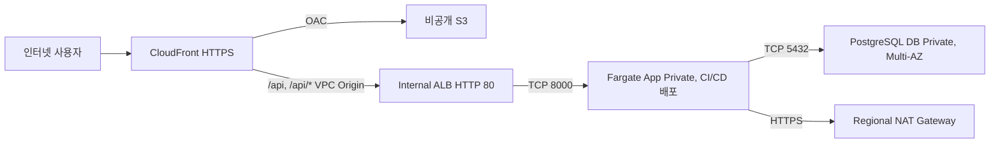

# dev ECS and PostgreSQL platform

서울 리전의 두 AZ에 CloudFront + S3, Internal ALB + Fargate, PostgreSQL Multi-AZ 인프라를 구성해요. AWS Provider와 Backend는 `sbh-platform` 프로필을 사용해요.

이 Root Module은 ECS Cluster, 로그 그룹과 네트워크 및 접근 기반, 초기값으로 채운 `DATABASE_URL` Parameter를 만들어요. Task Definition과 Service는 CI/CD가 생성하고 갱신해요. Terraform에서 이미지 Digest를 입력받거나 서비스 revision을 관리하지 않아요.

## 구조



| 계층 | ap-northeast-2a | ap-northeast-2c | 인터넷 경로 |
|---|---|---|---|
| App Private | `10.20.10.0/24` | `10.20.11.0/24` | Regional NAT |
| DB Private | `10.20.20.0/24` | `10.20.21.0/24` | 기본 경로 없음 |

Public Subnet과 Public Route Table은 만들지 않아요. Regional NAT는 VPC에 하나를 만들고 두 App Subnet이 같은 NAT ID를 사용해요. NAT가 인터넷으로 송신하고 CloudFront VPC Origin을 만들 수 있도록 Internet Gateway는 VPC에 연결해요. App, DB와 Internal ALB에는 직접 인터넷 수신 경로가 없어요. Regional NAT의 송신 IP는 AWS가 관리하며 요금은 활성 AZ별로 발생해요. [AWS Regional NAT](https://docs.aws.amazon.com/vpc/latest/userguide/nat-gateways-regional.html), [CloudFront VPC Origin](https://docs.aws.amazon.com/AmazonCloudFront/latest/DeveloperGuide/private-content-vpc-origins.html), [NAT 요금](https://aws.amazon.com/vpc/pricing/)

DB는 PostgreSQL 17.11, db.t4g.small, gp3 20 GiB예요. 자동 장애 전환용 Primary와 Standby를 구성하고 읽기 복제본은 만들지 않아요. 암호화, 7일 백업, 삭제 보호와 최종 스냅샷을 사용해요. 백엔드는 `DATABASE_URL` 환경변수 하나로 접속하며 Task Definition의 Secret 참조로 주입해요.

dev 관리자 암호는 `module_managed_secret` 모드로 구성해요. Terraform이 `sbh-platform-dev-rds-postgres-master` Secret과 초기 Version을 만들고, 같은 암호를 기존 DB에 write-only 인수로 전달해요. RDS 관리형 자동 회전은 사용하지 않아요. 콘솔에서는 RDS 관리자 비밀번호와 Secret의 `password`를 같은 값으로 함께 변경해야 해요. 적용 및 검증 상태는 [Unit 12 기록](../../docs/ai-dlc/dev-rds-password-management.md), 변경 절차와 Terraform의 특정 Version 참조 제한은 [Runbook](../../docs/runbooks/ecs-postgresql-platform.md#rds-관리자-비밀번호)에 정리해요.

CI/CD는 이 인프라가 준비된 후 이미지 Digest로 Fargate Task Definition revision을 등록하고, 필요한 마이그레이션을 실행한 뒤 ECS Service를 생성하거나 새 revision으로 갱신해요. 서비스가 아직 없으면 ALB Target이 비어 있어 `/api`가 503을 반환할 수 있어요. [Runbook](../../docs/runbooks/ecs-postgresql-platform.md)에 배포 입력 계약을 정리했어요.

## 입력 속성

| 속성 | 타입 | 기본값 | 역할 |
|---|---|---|---|
| `vpc_cidr` | `string` | `"10.20.0.0/16"` | 네트워크 주소로 정렬된 IPv4 /16 CIDR이에요. |
| `container_port` | `number` | `8000` | ALB Target Group, Security Group과 CI/CD Task Definition이 맞춰야 할 앱 포트예요. |
| `health_check_path` | `string` | `"/api/health"` | ALB가 HTTP 200을 확인할 경로예요. |
| `postgres_engine_version` | `string` | `"17.11"` | PostgreSQL 버전이에요. 변경 시 리전 지원을 다시 확인하세요. |
| `postgres_instance_class` | `string` | `"db.t4g.small"` | DB 인스턴스 클래스예요. |
| `db_name` | `string` | `"freesia"` | 초기 데이터베이스 이름이에요. |
| `tags` | `map(string)` | `{}` | 추가 공통 태그예요. 빈 값, 필수 태그와 `Name`의 재정의, 공통 `ApplicationId`와 `DeploymentId`는 거부해요. `InfraId`는 정확한 대소문자를 사용해요. |

## 네이밍과 태깅

직접 관리하는 리소스는 `sbh-platform-dev-<type>-<purpose>` 형식으로 이름을 지정해요. VPC는 `sbh-platform-dev-vpc-shared`, ALB는 `sbh-platform-dev-alb-api`, Target Group은 `sbh-platform-dev-tg-api`, 프론트 S3 버킷은 `sbh-platform-dev-s3-web-<account-id>`예요. S3 버킷은 계정 ID로 전역 중복 가능성을 줄여요.

SSM Parameter의 실제 이름은 기존 배포 계약인 `/sbh/platform/demo/backend/DATABASE_URL`을 유지해요. `Name` 태그는 `sbh-platform-dev-ssm-database-url`이에요.

AWS Provider의 `default_tags`와 각 모듈의 `tags`에 `Project=SBH`, `Scope=platform`, `Environment=dev`, `ManagedBy=terraform`, `Owner=정호원`을 적용해요. 태그를 지원하는 각 리소스의 `Name`은 리소스 이름이나 역할에 맞춰 별도로 설정해요. 공유 리소스에 특정 앱이나 배포의 `ApplicationId`, `DeploymentId`는 넣지 않아요. `InfraId`는 시스템의 실제 식별자가 정해지면 추가할 수 있어요.

CloudFront OAC처럼 태그를 지원하지 않는 구성 요소는 서비스가 허용하는 이름으로 식별해요. dev 관리자 Secret은 모듈이 공통 태그를 붙여 관리해요. CloudFront VPC Origin의 하위 리소스 등 AWS가 생성하는 리소스의 태그는 Apply 이후 별도로 확인해야 해요. Terraform Plan은 이 확인을 대신하지 않아요.

## 출력 속성

| 속성 | 역할 |
|---|---|
| `network` | VPC, App/DB Private Subnet과 Regional NAT 식별 정보예요. |
| `frontend` | S3 버킷, CloudFront Distribution ID와 HTTPS 주소예요. |
| `backend` | CI/CD가 배포에 사용할 ECR, ECS Cluster, 로그 그룹, ALB, 보안 그룹과 IAM Role 식별 정보예요. |
| `database` | DB 식별자, 주소, 포트, 이름, 관리자 Secret ARN과 `DATABASE_URL` Parameter ARN이에요. 비밀값은 출력하지 않아요. |

| 출력 객체 | 내부 속성 | 역할 |
|---|---|---|
| `network` | `vpc_id` | VPC ID예요. |
| `network` | `public_subnet_ids` | 호환성을 위해 유지하며 현재 dev에서는 빈 Map이에요. |
| `network` | `app_subnet_ids` | 두 AZ의 App Subnet ID예요. |
| `network` | `db_subnet_ids` | 두 AZ의 DB Subnet ID예요. |
| `network` | `nat_gateway_ids` | 두 App AZ 키가 같은 Regional NAT ID를 가리켜요. |
| `frontend` | `bucket_name` | 프론트엔드 버킷 이름이에요. 계정 ID로 고유성을 확보해요. |
| `frontend` | `distribution_id` | CloudFront ID예요. |
| `frontend` | `url` | 현재 State의 사용자 도메인 HTTPS 주소 `https://sbh.howon.me`예요. |
| `backend` | `ecr_repository_url` | 이미지 저장소 주소예요. |
| `backend` | `cluster_name` | ECS Cluster 이름이에요. |
| `backend` | `cluster_arn` | ECS Cluster ARN이에요. |
| `backend` | `log_group_name` | 로그 그룹 이름이에요. |
| `backend` | `alb_arn` | Internal ALB ARN이에요. |
| `backend` | `alb_dns_name` | Internal ALB DNS 이름이에요. |
| `backend` | `target_group_arn` | CI/CD가 ECS Service에 연결할 IP Target Group ARN이에요. |
| `backend` | `ecs_security_group_id` | CI/CD가 Fargate Task에 붙일 Security Group ID예요. |
| `backend` | `execution_role_arn` | 이미지, 로그와 `DATABASE_URL` 주입 Role이에요. |
| `backend` | `task_role_arn` | 앱 AWS API Role이에요. 현재 부여한 권한은 없어요. |
| `backend` | `container_name` | Target Group에 연결할 컨테이너 이름 `app`이에요. |
| `backend` | `container_port` | Target Group과 일치해야 할 컨테이너 포트예요. |
| `database` | `identifier` | DB 식별자예요. |
| `database` | `address` | Primary 접속 DNS예요. |
| `database` | `port` | TCP 5432예요. |
| `database` | `name` | DB 이름이에요. |
| `database` | `master_secret_arn` | 모듈이 생성하는 비관리형 관리자 Secret ARN이에요. |
| `database` | `database_url_parameter_arn` | Terraform이 초기값으로 생성하는 SSM Parameter ARN이에요. 실제 접속값은 운영 경로에서 갱신해요. |

## DATABASE_URL 준비

Parameter 이름은 `/sbh/platform/demo/backend/DATABASE_URL`이고 유형은 SecureString, 등급은 Standard예요. Terraform이 기본 `alias/aws/ssm` 키로 암호화한 초기값 `NOT_CONFIGURED`를 생성해요. 이 초기값으로는 DB에 연결할 수 없어요. 첫 서비스 활성화 전에 운영 경로에서 기존 Parameter 값을 갱신하고, 현재 DB 주소와 `db_name`을 사용해 `postgresql+psycopg://<앱 사용자>:<URL 인코딩된 암호>@<DB 주소>:5432/<DB 이름>?sslmode=require` 형식으로 구성해요. 비밀번호의 예약 문자는 URL 인코딩해야 해요.

초기값은 `value_wo`로 전달하고 갱신 번호는 1로 고정해요. 현재 AWS Provider는 refresh 때 값을 복호화해 읽지만, write-only 모드에서는 실제 값을 Plan과 State에 저장하지 않아요. 생성 이후 Terraform은 값과 값 쓰기를 유발하는 메타데이터 변경을 무시하고 태그만 관리해요. `overwrite = false`로 기존 외부 Parameter를 덮어쓰지 않으며 `prevent_destroy = true`로 삭제와 이름 변경에 따른 교체를 막아요. 이름, 유형, 등급, 키와 설명을 바꾸려면 별도 설계가 필요해요. 고객 관리 KMS 키를 선택한다면 실행 역할에 해당 키의 `kms:Decrypt` 권한도 검토해야 해요.

현재 기본 DB 이름은 `freesia`예요. 앱 사용자는 RDS 관리자 계정과 별도로 만들어야 해요. Parameter 값, 비밀번호와 DB 접속 URL을 tfvars, Terraform 출력, Plan이나 명령행 인자에 넣지 마세요. 등록과 마이그레이션 Task의 선행 조건은 [Runbook](../../docs/runbooks/ecs-postgresql-platform.md)을 따라 확인해요.

## Backend와 실제 Plan

Terraform 1.11 이상이 필요해요. 기존 상태 전용 S3 버킷을 사용하고 프론트엔드 버킷과 분리해요. Backend는 서울 리전, `encrypt = true`, `use_lockfile = true`로 구성했어요.

저장소 루트에서 실행하세요. `backend.local.hcl`에는 실제 기존 버킷 이름과 State Key를 넣어요. 이 파일과 State, Plan 파일은 Git에서 제외해요.

```sh
cp env/dev/backend.hcl.example env/dev/backend.local.hcl
# backend.local.hcl의 bucket/key를 승인한 기존 값으로 수정합니다.
AWS_PROFILE=sbh-platform ./tf dev init -backend-config=backend.local.hcl -input=false
AWS_PROFILE=sbh-platform ./tf dev plan -input=false
```

Terraform Plan은 잠금 파일을 잠시 생성하고 삭제할 수 있어요. Backend IAM에는 State 읽기/쓰기와 잠금 파일의 Get/Put/Delete 권한이 필요해요. 버킷 버전 관리와 암호화 설정도 별도로 유지하세요. [S3 Backend 권한](https://developer.hashicorp.com/terraform/language/backend/s3)

2026-10-01 사용자 도메인 Apply 후 S3 Backend State에는 관리 리소스 인스턴스 48개가 있었고, Unit 11 Parameter 생성 Apply 후에는 serial 10, 49개예요. 아래의 초기 구축 Plan은 그 전 시점 기록이에요. ACM 인증서 발급과 기존 CloudFront 배포본의 별칭 및 인증서 적용은 끝났고, 사용자는 외부 접속이 정상이라고 확인했어요. 현재 컴퓨터에서는 보안 DNS 차단 때문에 HTTPS 응답 코드를 직접 확인할 수 없었어요. [별도 AI-DLC 기록](../../docs/ai-dlc/dev-cloudfront-custom-domain.md)을 확인해요.

2026-10-01 Unit 11의 SSM 대상 지정 Plan 1 add / 0 change / 0 destroy를 승인받아 Apply했고 Parameter 하나를 생성했어요. AWS 메타데이터는 SecureString, Standard, `alias/aws/ssm`, 버전 1이에요. State의 값 비저장과 ARN 및 IAM 계약도 확인했어요. 적용 후 전체 Plan은 0 add / 1 change / 0 destroy로 Parameter 추가 변경이 없고 기존 CloudFront Origin 표현 차이만 남아요. Terraform 1.16.4로 수행했으며 실제 접속값 갱신과 DB 연결은 아직 검증하지 않았어요. [Unit 11 검증 기록](../../docs/ai-dlc/ecs-postgresql-platform.md#후속-변경-dev-database_url-parameter-리소스-생성)에 명령과 결과를 정리했어요.

2026-10-01 Unit 12의 비관리형 전환과 버전 정밀도 수정 Apply를 완료했어요. 기존 DB와 접속 주소 및 Secret 컨테이너를 유지했고 현재 DB는 `available`이에요. 모듈 mock 16개, dev mock 4개, 전체 mock Plan 점검 2개와 fmt 및 validate가 통과했어요. 초기 전환 뒤 반복 교체를 유발한 큰 버전 번호를 52비트로 수정했고 State와 실제 Plan에서 해소를 확인했어요. refresh-only로 새 Secret ARN 출력을 갱신해 최종 State는 serial 15, 관리 인스턴스 51개예요. 전체 Plan은 0 add / 1 change / 0 destroy로 기존 CloudFront 차이만 남아요. 실제 DB 로그인은 미수행이에요. 이번 변경은 커밋 `b995fa7`으로 main에 푸시하고 원격 SHA 일치를 확인했어요.

## 로컬 검증

```sh
terraform -chdir=env/dev init -backend=false -input=false
terraform fmt -check -recursive env/dev modules/network modules/s3 modules/ecs modules/cloudfront
terraform -chdir=env/dev validate
mkdir -p .local
# Terraform 1.17 이상의 ephemeral mock 지원 CLI를 사용합니다.
.local/terraform-1.17.0-beta2/terraform -chdir=env/dev test -test-directory=tests-terraform-1.17 -verbose -json > .local/dev-tests.jsonl
python3 scripts/check-dev-test-plan.py .local/dev-tests.jsonl
node --test modules/cloudfront/tests/spa.test.cjs
```

AWS와 Random Provider를 mock으로 대체해 자격 증명 없이 테스트해요. 기존 RDS 모듈에는 두 Provider의 ephemeral 선언이 있어 1.16.4에서 결합 mock 테스트가 실행되지 않아요. 기존 RDS 테스트와 같은 방식으로 `tests-terraform-1.17`에 테스트를 분리하고, [공식 1.17.0-beta2 테스트 CLI](https://releases.hashicorp.com/terraform/1.17.0-beta2/)를 Git 제외 폴더에 내려받아 SHA-256을 확인한 뒤 사용했어요. 모듈과 실제 Plan은 1.11 이상에서 사용해요. CI/CD 소유 경계 변경 후 안정 버전 1.15.4로 실행한 당시 실제 Plan은 46개 생성, 변경과 삭제 0개였어요. 당시 Task Definition과 Service는 Plan에 없었어요. mock 테스트는 AWS 리소스나 Backend State를 만들지 않아요.

기본 포트와 재정의 포트의 인프라 Plan을 검사해요. Private Subnet 4개, Regional NAT 1개, Public Subnet과 수동 EIP 부재, DB 경로 격리, RDS Multi-AZ, SecureString Parameter 하나와 값 비저장, 실행 역할의 SSM 최소 권한, CI/CD 인수인계 출력과 Terraform 관리 Task Definition 및 Service 부재를 확인해요. Plan은 실제 접속값 준비나 DB 연결을 증명하지 않아요. 배포와 운영 절차는 [Runbook](../../docs/runbooks/ecs-postgresql-platform.md)에 있어요.
